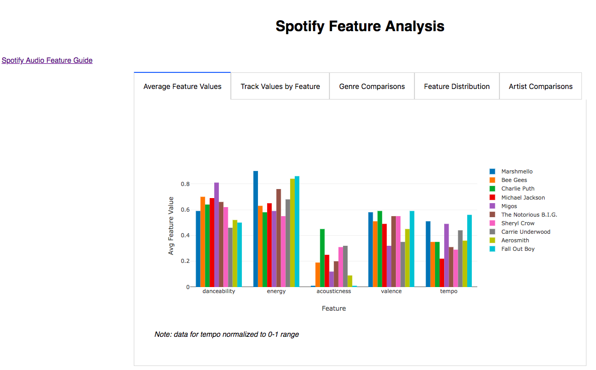
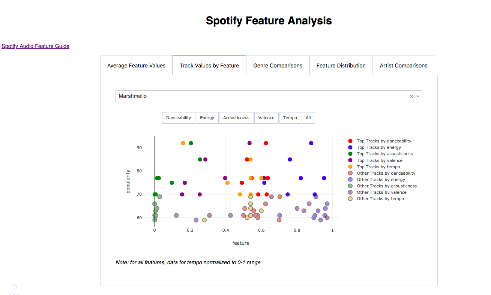
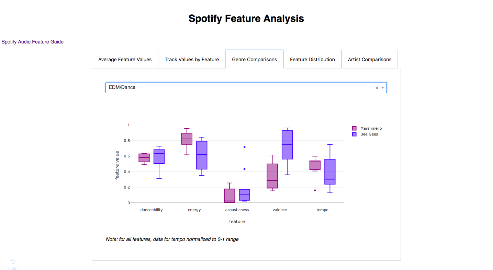
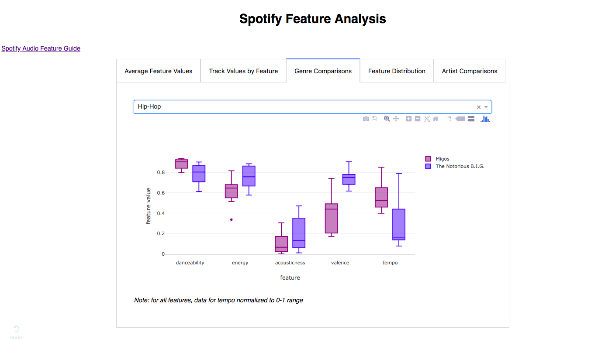
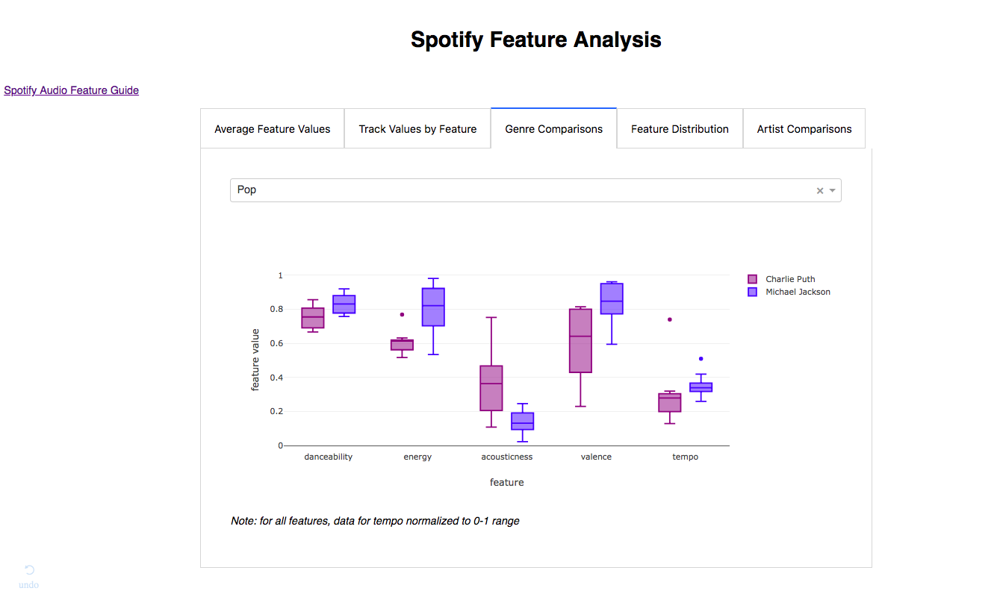
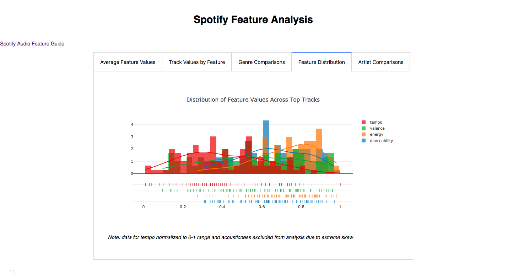
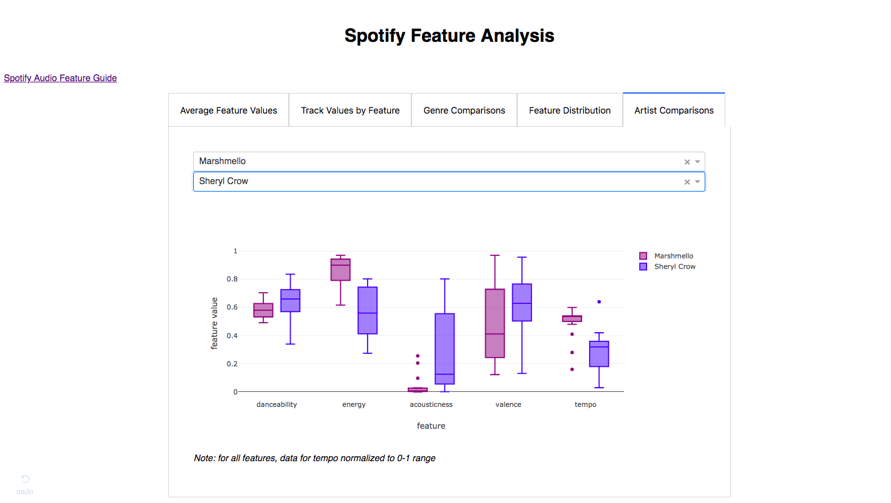

# Visualization & Evaluation of Artists and Tracks on Spotify

## Project Motivation
The purpose of this project was to understand the characteristics of artists and tracks that are representative of their genres. The Spotify API allows access to 

## ETL
Due to the nature of the Spotify API (artist/album/track IDs must be specified in order to retrieve associated data), 8 artists from diverse genres were selected:

* Pop: Charlie Puth, Michael Jackson
* Hip-Hop: Migos, Biggie Smalls
* Rock: Fall-Out Boy, Aerosmith
* Country: Carrie Underwood, Sheryl Crow
* Dance/EDM: Bee-Gees, Marshmello

For each genre, two artists were selected: a modern artist and a past artist. These artists may be considered representative of their respective genre for the time period. 

## SQL Database Schema
SQLAlchemy was used to construct the schema for the SQL database. 4 classes were built, with the following relationships:

## Dashboard
A dashboard, with Dash as the front-end and Flask as the back-end, was built to display visualizations. 

### Average Feature Values by Artist

### Select Artist Track Visualization by Feature(s) 

### Intra-Genre Generational Differences

### Distribution of All Top Tracks by Feature

### Artist Feature Comparisons 

